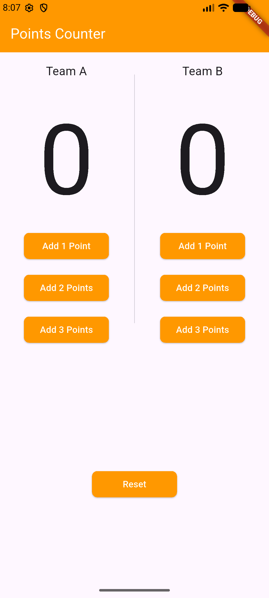

# 🏀 Basketball Points Counter

A sleek and responsive Flutter application designed to track basketball scores for two teams. This project focuses on **State Management**, **Modular UI components**, and a clean user experience.

## ✨ Features
* **Dual Team Tracking:** Independent counters for Team A and Team B.
* **Dynamic Scoring:** Buttons for +1, +2, and +3 points.
* **Reset Functionality:** Quickly start a new game with a dedicated reset button.
* **Modular Codebase:** Clean architecture using custom widgets for buttons and team sections.

## 🛠️ Tech Stack
* **Framework:** [Flutter](https://flutter.dev/)
* **Language:** [Dart](https://dart.dev/)
* **Platform:** Android / iOS / Web

## 📸 Preview
 
*(Don't forget to add a screenshot named preview.png in your project folder!)*

## 🚀 How to Run
1. Clone the repository:
   ```bash
   git clone [https://github.com/dark-zid-code/basketball_points_counter.git](https://github.com/dark-zid-code/basketball_points_counter.git)